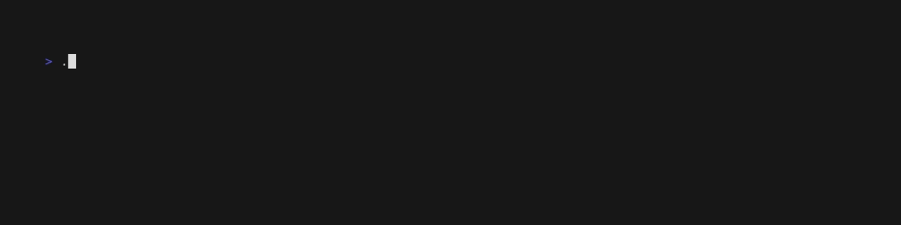
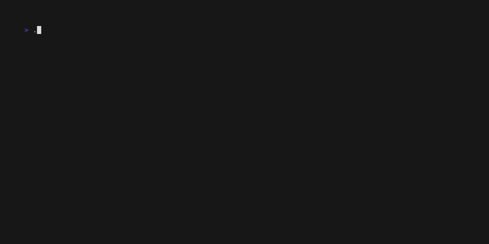
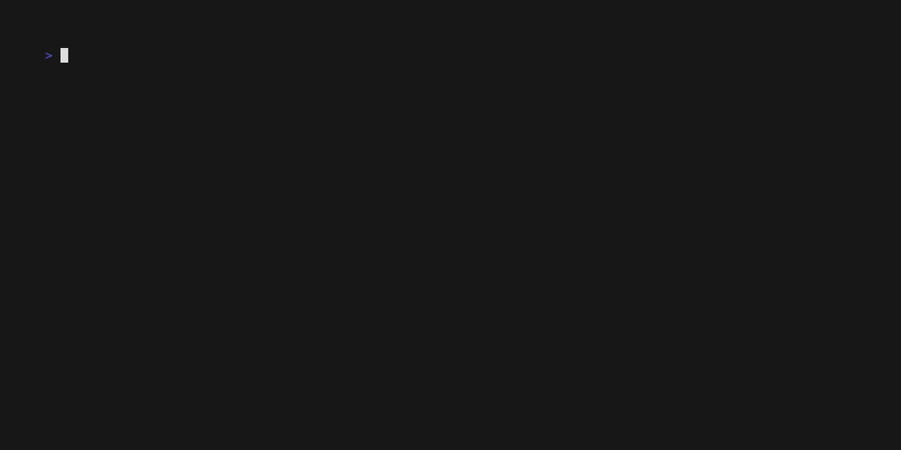
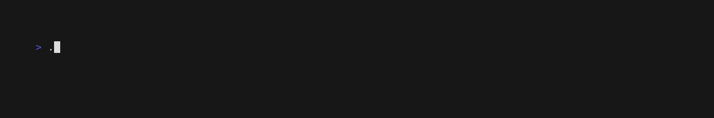

# SLIDER

**Slider** is a server / client in a binary that can act as basic a Command & Control (C2) or an Agent. 

The main purpose of Slider was having a small tool, easy to transfer and go much unnoticed, that would help maintaining 
persistence, specially on those cases where the use of some frameworks would be limited for whatever 
reason. 
Then the functionality has been extended a little bit, so it allows for using it in other scenarios.

Slider can be used to: 
* Send a fully interactive Reverse Shell from Client to Server, 
* Run commands remotely, 
* Upload / download files, 
* Run a reverse socks v5 server, 

All through a cyphered connection, while allowing clients and servers authenticate and verify each other through
[Ed25519](https://ed25519.cr.yp.to/) key pairs.

## How does it work?
In a normal scenario, a Slider Server runs a web server on a given port, waiting for Slider clients to establish websocket
connections. 

Those websocket connections are then transformed into network connections which are then reused to create an SSH Server on
the Server side and an SSH Client on the Client side, encrypting this way the connection and providing a way to authenticate
Servers and Clients to each other. 

Once the connectivity is established (a Session is created) all functionality is requested through SSH requests and
responses with data streamed through SSH Channels or, in some cases, through SSH requests / response payloads.

Clients can also be listeners, in these scenarios Servers will interactively connect to Clients, initiating websocket
client connections while remaining as SSH Servers. 

## External Dependencies
For the sake of keeping the size contained, external libraries are used when they remove a particular overhead or 
drastically simplify the core functionality, while for the rest, only the Standard Library is used.

Currently, if compiled omitting the symbol table and debug information and omitting the DWARF symbol table 
(`-ldflags "-s -w"`), the size is kept below 6mb. 
If also compressing it using [UPX](https://github.com/upx/upx) with the `--brute` flag, the size is kept somewhere 
around 2mb.

Slider Release Binaries are already compressed with [UPX](https://github.com/upx/upx) if supported.

Currently Slider uses the following external dependencies:
* [gorilla/websocket](https://github.com/gorilla/websocket) - implementation of the WebSocket Protocol
* [creack/pty](https://github.com/creack/pty) - managing PTYs on *nix systems
* [UserExistsError/conpty](https://github.com/UserExistsError/conpty) - managing PTYs on Windows Systems
* [armon/go-socks5](https://github.com/armon/go-socks5) - using an existing network connection as socks transport
* [rurreac/go-shellcode](https://github.com/rurreac/go-shellcode) - executing shellcode on the target Client

## Building Slider

At the time of writing and due to the experimental Shellcode feature building Slider requires CGO.

If cross compiling from macOS to Linux, a C/C++ compiler (such as [Zig](https://formulae.brew.sh/formula/zig)) will be
required as well as the following environment variables.

```
CGO_ENABLED=1
CC=zig cc -target x86_64-linux
CXX=zig c++ -target x86_64-linux
```

## Server

```
Slider Server

  Creates a new Slider Server instance and waits for 
incoming Slider Client connections on the defined port.

  Interaction with Slider Clients can be performed through
its integrated Console by pressing CTR^C at any time.

Usage: ./slider server [flags]

Flags:
  -address string
        Server will bind to this address (default "0.0.0.0")
  -auth
        Enables Key authentication of Clients
  -certs string
        Path of a valid slider-certs json file
  -colorless
        Disables logging colors
  -experimental
        Enable experimental features
  -keepalive duration
        Sets keepalive interval vs Clients (default 1m0s)
  -keypath string
        Path for reading or storing a Server key
  -keystore
        Store Server key for later use
  -port int
        Port where Server will listen (default 8080)
  -verbose string
        Adds verbosity [debug|info|warn|error|off] (default "info")
```



### Environment Variables

#### `SLIDER_HOME`:
When defined, Slider will use this path to save all information.

When not defined / the environment variable does not exist or has an empty value:
1. Slider will try to obtain the User Home directory. If this fails,
2. Slider will use the current working path.

#### `SLIDER_CERT_JAR`:
When not defined or its value is `1` or `true`. Changes to certificates (creation or deletion),
will be stored.

If any other value is found then changes to certificates won't be stored. Note that if in this case,
the value is not `0` or `false`, you will be warned, just in case this wasn't on purpose.

Slider only creates and uses [Ed25519](https://ed25519.cr.yp.to/) keys.

### Server Flags Overview

#### `-address`:
Local address to bind to. By default, Slider binds to all local addresses

#### `-auth` and `-certs`:
By default, Slider Clients do not require any authentication to connect to Server.

* `-auth`: Enables and requires SSH Key-Based authentication to all Clients.
* `-certs`: Is an optional parameter, holding the path of a Certificate Jar file. This flag requires authentication is
  enabled.

When `-auth` is passed, a few things will and may happen:
1. If `-cert` flag is not provided:
    1. Slider will check if the default certificate file (`client-certs.json`) exists in "[Slider Home directory](#slider_home)".
    2. If `client-certs.json` exists, Slider will load all existing KeyPairs into its Certificate Jar.
    3. If `client-certs.json` does not exist, Slider will initialize its Certificate Jar with a new KeyPair  
       and store it a new `client-certs.json` file.
2. if `-cert` flag is provided:
    1. If the file exists, Slider will load all KeyPairs in its Certificate Jar.
    2. If the file does not exist, Slider will initialize the Certificate Jar with a new certificate and attempt to save it
       in the provided path.

A note of the Certificates Files, whether changes to the Certificate Jar are stored depend on the "[SLIDER_CERT_JAR](#slider_cert_jar)"
environment variable.

The Certificate Jar will be saved in whatever is resolved from the  "[SLIDER_CERT_JAR](#slider_cert_jar)" + `/.certs`
on *nix hosts, or `\certs` on Windows hosts.


#### `-colorless`:
By default, regardless of the OS, if Slider runs on a PTY, logs will show their log level using colors. If this flag is passed
then logs will have no colors.

#### `-keepalive`:
By default, Slider pings every Client Session (every 60s) to ensure its available, otherwise kills the Session.

This value can be changed to any other duration value or set to `0` to completely disable it.

#### `-keypath` and `-keystore`:
By default, everytime Slider Server is executed, a new in memory KeyPair is generated, and so it's lost on termination.

When the flag `-keystore` is provided, Slider will store a new KeyPair in disk, but:
1. If `-keypath` was not provided, and the default key file `server-cert.json` exists in the "[Slider Home directory](#slider_home)",
   then it will be loaded instead or overriding it.
2. If `-keypath` was provided:
    1. If the path exists, Slider will attempt to load its KeyPair.
    2. If the path does not exist, Slider will save a new KeyPair in this path.

#### `-port`:
By default, Slider listens in port `8080`. Specify any other port using this flag.

#### `-verbose`:
Choose the log level verbosity between debug, info, warn and error. When verbosity is set to `off` only non labeled and
fatal logs will be shown.

#### `-experimental`
Extends Slider functionality with features that are either unstable, being tested and/or susceptible to be removed at
any time.

### Console

```
Slider > help

  Commands  Description  

  bg         Puts Console into background and returns to logging output  
  connect    Receives the address of a Client to connect to              
  download   Downloads file passed as an argument from Client            
  execute    Runs a command remotely and returns the output              
  exit       Exits Console and terminates the Server                     
  help       Shows this output                                           
  sessions   Interacts with Client Sessions                              
  shellcode  Runs a ShellCode on the target Client (Experimental)        
  socks      Runs or Kills a Reverse Socks server                        
  upload     Uploads file passed as an argument to Client
```

#### Commands walk through

##### Sessions
```
Slider > sessions -h
Interacts with Client Sessions

When run without parameters, all available Sessions will be listed.

Usage: sessions [flags]

Flags:
  -d int
    	Disconnect Session ID
  -i int
    	Starts Interactive Shell on a Session ID
  -k int
    	Kills Session ID
```
Each connection from a Slider Client creates a new Session, and when that connection is broken or terminated, the
Session is dropped.
The `sessions` command allows you to interact with each opened Session. Through the `sessions` command it is possible
to list, kill, disconnect or receive a Shell from a given Session.

If the Client host is running *nix OS or a Windows version with ConPTY (introduced in 2018) the spawned Shell will be
fully interactive as well.

A note between killing a Session and disconnecting from a Session: 
* Disconnect, closes the Session at the Server side, it would be equivalent to terminating the Server. 
  * If the Client is configured with the `-retry` option, the Client will reconnect to the Server if available of the next
  try, creating a new Session.
  * If the Client is not configured with the `-retry` option, and is Not configured with the `-listener` option, once it
runs its next keepalive check will shut down.  
* Kill, is equivalent to terminate the execution of the Client, independently if it's a regular Client or a Listener one. 


##### Connect
```
Slider > connect -h
Receives the address of a Client to connect to

Connects to a Client configured as Listener and creates a new Session

Usage: connect <client_address:port>
```
Regular Clients automatically connect back to the Server, but if we want to open a Session to a Client working as Listener
then we'll need to use the `connect` command.
This command will try to open a Session in the background, and you will be notified whether the connection was
successful or not. `connect` will hold until that confirmation is given, or otherwise considered timed out (10s).



##### Execute
```
Slider > execute -h
Runs a command remotely and returns the output

Usage: execute [flags] [command]

Flags:
  -a	Runs given command on every Session
  -s int
    	Runs given command on a Session ID
```
If you want to run a single OS command on a client rather than interacting with the session itself you can use Console
`execute` command.
Note that `execute`:
* Allows you to pass redirections or pipes to the Client as part of the command as well.
* A loading prompt will be visible if the command takes a while to process. If you are expecting an output with lots 
of data, this is a good indication that you should run the command from an interactive Shell instead to reduce the 
unnecessary overhead.



##### Socks
```
Slider > socks -h
Runs or Kills a Reverse Socks server

Usage: socks [flags]

Flags:
  -k int
    	Kills Socks5 Listener and Server on a Session ID
  -p int
    	Uses this port number as local Listener, otherwise randomly selected
  -s int
    	Runs a Socks5 server over an SSH Channel on a Session ID
```
If we would like to create a reverse Socks v5 server (or kill an existing one), we could do it using the `socks`
command.
Under the hood a specific SSH Channel is created for this purpose. The Client creates a Socks server and sends it
to the Channel while the Server opens a local port and send the incoming connections to the other end of that same
Channel.  
By default `socks` only requires specifying a Client Session and the Server local port will be automatically assigned
by the OS, but we can also specify a port using the `-p`.


##### Upload
```
Slider > upload -h
Uploads file passed as an argument to Client

Note that if no destination name is given, file will be uploaded with the same basename to the Client CWD.

Usage: upload [flags] [src] [dst]

Flags:
  -s int
    	Uploads file to selected Session ID
```
Mostly self-explanatory. Note that `[dst]` if provided must be a filepath. Also, be mindful to your destination, cause
if the file exists and the User that is running the Client has the right permissions, the contents of the file will
be overridden.

Checksum of the file is checked, if there is a mismatch you'll be warned.


##### Download
```
Slider > download -h
Downloads file passed as an argument from Client

* If no destination name is given, file will be downloaded with the same basename to the Server CWD.
* Downloading from a file list does not allow specifying destination.  

Usage: download [flags] [src] [dst]

Flags:
  -f string
    	Receives a file list with items to download
  -s int
    	Downloads file from a given a Session ID
```
Allows you to `download` a file from the client.

It is possible to pass a file list as an argument with the `-f` flag. Using this flag does not allow specifying a
destination. All files in the file list will be downloaded to [Slider Home Directory](#slider_home).
Each file will be saved with a concatenated name of the filepath as its basename.

Checksum of the file is checked, if there is a mismatch you'll be warned.


##### Certs
```
Slider > certs -h
Interacts with the Server Certificate Jar

When run without parameters, all available KeyPairs in the Certificate Jar will be listed.

Usage: certs [flags]

Flags:
  -n	Generate a new Key Pair
  -r int
    	Remove matching index from the Certificate Jar
```
The `certs` command requires that authentication is enabled on the Server otherwise it won't be listed or available.

Usually if the Server was run with `-auth` enabled there will be at least 1 KeyPair in the Certificate Jar.
The Private Key contained within the Keypair can be passed to the client so that it will authenticate against the
Server.


##### Shellcode
```
Slider > shellcode  
Runs a ShellCode on the target Client

Receives a HEX ShellCode string or a file containing a RAW shellcode and executes it on the target Client.

Usage: shellcode [flags] [arg]

Flags:
  -s int
            	Execute on this Session
```
This is an Experimental feature and can be removed at any time. Due to its nature it is highly unstable. 

> You are encouraged to generate your own encoded binary using a Payload of wish, upload it to the Client and execute it 
from a reverse Shell instead of using this feature. 
> Check [go-shellcode](https://github.com/rurreac/go-shellcode) for an example.

The process of transferring a Shellcode to a Client can be considered generally safe since happens through an SSH 
connection, and it's executed directly from memory, avoiding any AV static analysis.

There are a few caveats though for you to consider before using this feature.

###### Windows targets:

1. Machine Code sent to the client can not be encoded.
    

    Encoding a Payload requires a memory allocation with READ, WRITE and EXECUTE protections since WRITE permissions
    are required to decode the Payload in the allocated memory.
    This combination produces a hit on EDR/AV so it's not used.

2. If it's a Shellcode can not be Staged.

    
    The Machine Code will be "safely" executed once arrives the Client. If this Machine Code is staged and considered
    malicious (ie. meterpreter), it will be detected by Windows Defender or any other AV when reaching out for the 
    second stage.
    The end result will be the AV blocking the execution and removing the Slider binary.

3. Use Windows AMD64 Slider binaries if your target architecture is ARM64.

    
    If you intend to use msfvenom to generate Machine Code / Shellcode, note that at the time of writing there are no 
    payloads for Windows ARM64. 
    Since Windows ARM64 executes x64 binaries out of the box, better default to use Slider AMD64 binaries
    and x64 Payloads.


###### Unix like Targets

1. Machine Code can be encoded.


    Since Linux doesn't come with an EDR/AV out of the box the memory allocation is created with READ, WRITE and 
    EXECUTE protections which allows for the Shellcode to be decoded.

2. If it's a Shellcode, it might have to be Staged.

    
    If using msfvenom to generate a Shellcode, note that some non Staged Payloads only allow ELF as the output 
    format, while you will find that the Staged Payload will allow you to choose the output in RAW format.

    Following the same principle as in 1., on most circumstances it should be considered "safe".
    

## Client

```
Slider Client

  Creates a new Slider Client instance and connects 
to the defined Slider Server.

Usage: ./slider client [flags] <[server_address]:port>

Flags:
  -address string
    	Address the Listener will bind to (default "0.0.0.0")
  -colorless
    	Disables logging colors
  -fingerprint string
    	Server fingerprint for host verification
  -keepalive duration
    	Sets keepalive interval in seconds. (default 1m0s)
  -key string
    	Private key to use for authentication
  -listener
    	Client will listen for incoming Server connections
  -port int
    	Listener Port (default 8081)
  -retry
    	Retries reconnection indefinitely
  -verbose string
    	Adds verbosity [debug|info|warn|error|off] (default "info")
```



### Client Flags Overview

#### `-listener`, `-address` and `-port`:
A Slider Client by default connects back to a server on a given address:port, but it is also possible to run a Slider
Client in Listener mode (`-listener`).

When used as Listener it will listen for incoming connections on a bound address (`-address`) and port (`-port`). If not
configured, their default values are `0.0.0.0` and `8081` respectively.

One or several Servers will be able to open N number of sessions to a Client working as Listener at the same time.

The main two reasons for using a Slider Client on Listener mode are:
* The Server is located on a private network and a regular Client would not be able to reach it.
* Several Servers may want to collaborate on the same Client or use a particular Client as a gateway.

#### `-colorless`:
Same as with the Server, by default, regardless of the OS, if Slider runs on a PTY, logs will show their log level using
colors. If this flag is passed then logs will have no colors.

#### `-fingerprint`:
A Slider fingerprint represents a sha256sum string of a base64 encoded public key.

This flag could either be a sha256sum string or a file containing a list of sha256sum string, each one of them representing
a different Slider Server. This is useful in particular when the Client is running as Listener, and we want to be able to
authorize several Servers by their public key.
A connection from a Server with a fingerprint not successfully verified will be rejected.

#### `-keepalive`:
By default, Slider pings every Server Session (every 60s) to ensure its available, otherwise kills the Session.

This value can be changed to any other duration value or set to `0` to completely disable it.

Keepalive ensures that non listener clients terminate their connection to the server and shutdown, completely disabling
the keepalive will leave not listener clients hanging forever.

#### `-retry`:
Retry, is an available option on regular clients. a client configured with the `-retry` flag will try to reconnect to 
the server according to its `-keepalive` value. You will very likely want to tune `-keepalive` to either short 
reconnection intervals or expand them, according to your needs.

Enabling `-retry` will only have an effect if the Client was able to connect to the Server at least once, in other words, 
if the Client fails to connect to the Server on the first run it will terminate its execution as usual.

Combining Client `-retry` with Server `-auth` and maintaining different Certificate Jar Files, is a great way to work 
between different "Workspaces" where using one Certificate Jar or another will determine what Clients will automatically
reconnect to your Server and create a Session.

#### `-key`:
A Slider Key represents an Ed25519 private key base64 encoded.

Keys will only be used against a Server with authentication enabled otherwise will be disregarded.

A Client would use a key generated by the Server and stored in its Certificate Jar, since a Client using any
certificate in the Server Certificate Jar will be authorized to connect.

Typically, you would like to use `-fingerprints` to authenticate Servers on publicly exposed Clients (running as Listeners)
and `-key` to authenticate Clients on Servers with `-auth` enabled.

## Credits

This project is built on top the idea of using SSH over a websocket connection. 

The concept is not new, there are quite a few online services for such matter and if you are interested only on 
traversing through networks, then should definitively check [Chisel](https://github.com/jpillora/chisel) out, which 
brought us here and is way more versed and versatile in this matter.

As stated in the [dependencies](#external-dependencies) section:
* [gorilla/websocket](https://github.com/gorilla/websocket) - implementation of the WebSocket Protocol
* [creack/pty](https://github.com/creack/pty) - managing PTYs on *nix systems
* [UserExistsError/conpty](https://github.com/UserExistsError/conpty) - managing PTYs on Windows Systems
* [armon/go-socks5](https://github.com/armon/go-socks5) - using an existing network connection as socks transport

Lastly, all console captures were taken using [VHS](https://github.com/charmbracelet/vhs). Tape samples in 
the [doc](./doc) folder.