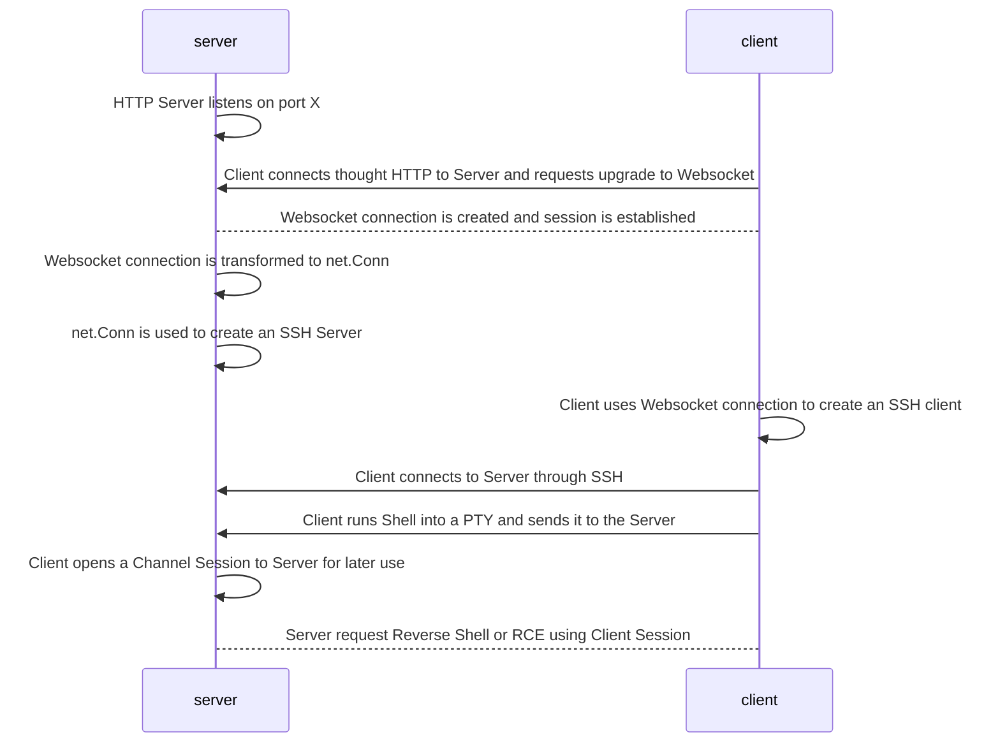
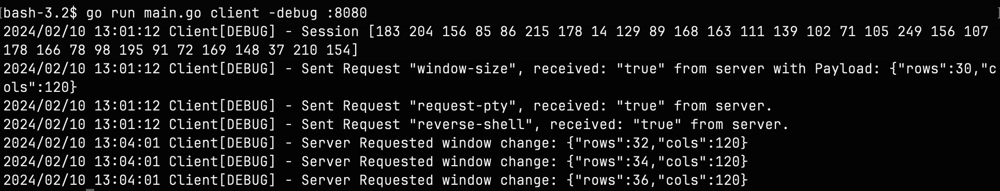

# SLIDER

## What is Slider for

Slider wants to be a tool used during Pentesting. 

Consisting in a Server / Client binary, in this early stage, Slider can be utilized to send a 
fully interactive Reverse Shell back to the Pentester host (or achieve RCE) while pursuing a low detection level 
using a well known protocol through an encrypted connection.

## How does it work

In a nutshell, Slider works this way:

### Slider Server Output

### Slider Client Output

